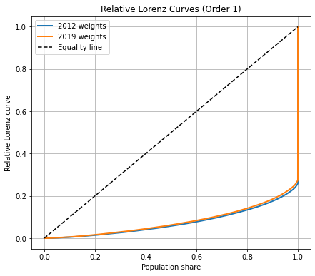
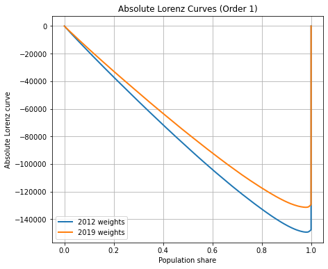
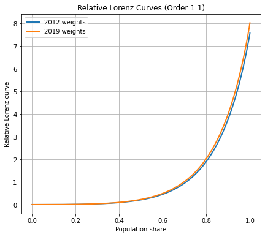
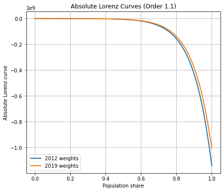

# Fractional Lorenz Dominance

`FractionalLorenz` is a Python package for computing **relative** and **absolute Lorenz curves** of arbitrary integer and fractional order together with their associated inequality indices.

The package implements the recursive Lorenz families and the fractional interpolation introduced in the accompanying paper.

---

# Installation

Clone the repository

```bash
git clone https://github.com/your_username/FractionalLorenz.git
```

or simply copy `FractionalLorenz.py` into your project.

## Dependencies

- numpy
- scipy
- matplotlib
- pandas (optional, for data handling)

---

# Relative and Absolute Lorenz Curves

The package computes both the **relative** and **absolute** Lorenz families.

## Relative Lorenz curves

```python
from FractionalLorenz import FractionalLorenz

L = FractionalLorenz()

L.fit(
    y,
    weight=weights,
    dominance_param=1,
    kind="relative"
)

L.graph()
```

* kind="relative": computes the family of (relative) Lorenz curves. 

* weights: your local variable representing sample weights (None otherwise)

* dominance_param=1: Lorenz curve or order 1 (the usual Lorenz curve) 

* L.graph(): returns the curves of order dominance_param
  
---

## Absolute Lorenz curves

Simply replace

```python
kind="relative"
```

by

```python
kind="absolute"
```

```python
L.fit(
    y,
    weight=weights,
    dominance_param=1,
    kind="absolute"
)

L.graph()
```


---

# Fractional Lorenz Curves

Fractional orders are obtained by specifying

```python
fractional_param
```

```python
L.fit(
    y,
    weight=weights,
    dominance_param=1,
    fractional_param=0.4,
    kind="relative"
)
```
Or

```python
L.fit(
    y,
    weight=weights,
    dominance_param=2,
    fractional_param=0.8,
    kind="absolute"
)
```

* fractional_param is the fractional paramter

---

# Inequality Indices

The associated inequality coefficient is obtained with

```python
L.inequality_index()
```

For example,

```python
L.fit(
    y,
    weight=weights,
    dominance_param=1,
    kind="relative"
)

gini = L.inequality_index()
```

returns the ordinary **relative Gini coefficient**.

Similarly,

```python
L.fit(
    y,
    weight=weights,
    dominance_param=1,
    kind="absolute"
)

gini_absolute = L.inequality_index()
```

returns the ordinary **absolute Gini coefficient** that is the Gini Mean Difference (GMD).

Higher and fractional orders are obtained by modifying

```python
dominance_param
```

and

```python
fractional_param
```

respectively.

> **Note.**
>
> The user indexing follows the Lorenz curve order:
>
> - `dominance_param = 1` corresponds to the ordinary Gini coefficient;
> - `dominance_param = 2` corresponds to the second-order Gini family;
> - `dominance_param = 3` corresponds to the third-order Gini family;
> - etc.

---

# Minimal Fractional Order

The package provides a routine for determining the smallest fractional order for which two Lorenz curves no longer cross.

```python
FractionalLorenz.minimal_fractional_order(
    y,
    weight1,
    weight2,
    kind="relative"
)
```

---

# Examples

## Relative Lorenz curve (order 1)



---

## Absolute Lorenz curve (order 1)



---

## Fractional relative Lorenz curve

Example for the fractional order \(1+c\).



---

## Fractional absolute Lorenz curve

Example for the fractional order \(1+c\).



---

# References

If you use this package in academic work, please cite the accompanying paper introducing the fractional Lorenz families and their associated inequality measures.
